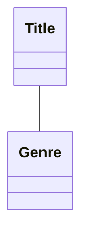
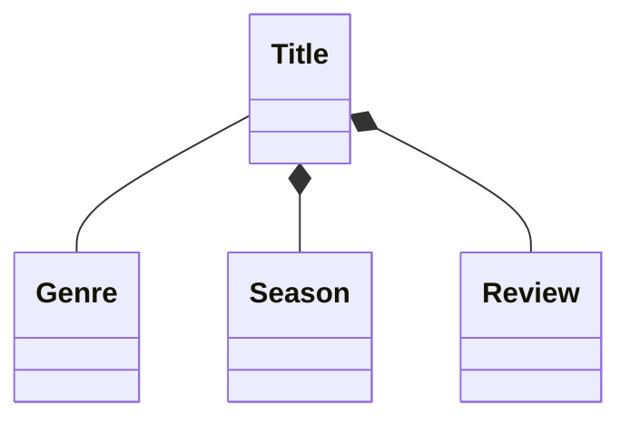
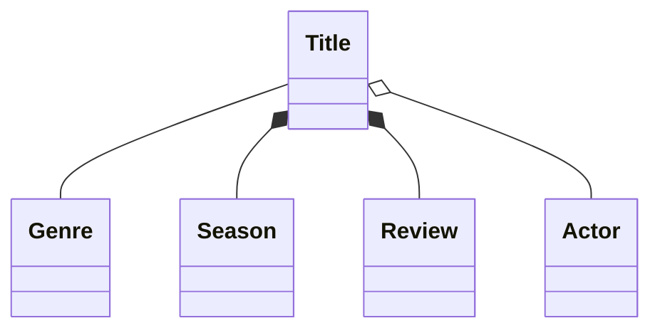

# Relationships 

## Association 

- loosest type 
- no owner of relationship 

## Composite 

- diamond is the side holding the reference 
- closest type of relationship (parent child)

## Aggregate

- closer than association but looser than composite
- parent child where the child can exist independently 
