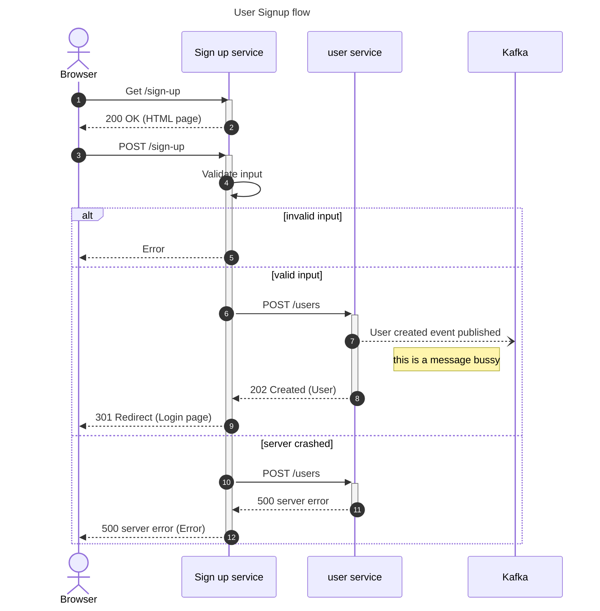

# Sequence diagram

```mermaid
sequenceDiagram
  autonumber
  title User Signup flow
  actor B as Browser
  participant SUS as Sign up service
  participant US as user service
  participant Kafka
  
  B->>SUS: Get /sign-up
  activate SUS
  SUS-->>B: 200 OK (HTML page)
  deactivate SUS
  
  B->>+SUS: POST /sign-up
  SUS->>SUS: Validate input 
  
  alt invalid input 
    SUS-->>B: Error
  else valid input 
    SUS->>+US: POST /users
    US--)Kafka: User created event published 
    Note left of Kafka: this is a message bussy 
    US-->>-SUS: 202 Created (User)
    SUS-->>B: 301 Redirect (Login page)
  else server crashed 
      SUS->>+US: POST /users
      US-->>-SUS: 500 server error 
      SUS-->>-B: 500 server error (Error)
  end
  link US: {"Repo": "https://www.example.com/repository"}
```
